# Living Portfolio Gallery - Quick Start Guide

## 🚀 What Was Created

A **completely redesigned GitHub profile** with a modern "Living Portfolio Gallery" aesthetic featuring:

1. **Animated SVG Character** - A custom-coded developer avatar that blinks, types, and breathes
2. **Journey Timeline** - Visual representation of your coding journey from 2020 to 2025+
3. **Gamification System** - RPG-style stats with levels, XP, achievements, and badges
4. **Card-Based Skills** - Collapsible skill categories with proficiency ratings
5. **Project Gallery** - Showcases 4 featured projects plus expandable list
6. **GitHub Stats Dashboard** - Real-time stats with custom purple/pink color scheme
7. **Modern Contact Section** - Social links with colorful icons
8. **Easter Eggs** - Hidden messages and quotes for curious visitors

---

## 🎨 Design Differences from Traditional Profiles

| Feature | Traditional Profile | This Design |
|---------|-------------------|-------------|
| **Aesthetic** | Dark/Cyberpunk | Light/Modern/Glassmorphism |
| **Layout** | Linear/Static | Card-Based/Interactive |
| **Animations** | Glitch effects | Smooth organic motion |
| **Colors** | Neon greens | Soft purples & pinks |
| **Tone** | Technical/Edgy | Professional/Friendly |
| **Gamification** | None or basic | Full RPG-style system |

---

## 📋 What You Need to Do

### Immediate Actions (Required):

1. **Review the Profile**
   - Visit your GitHub profile to see how it renders
   - Check on both desktop and mobile
   - Verify all animations work properly

2. **Update Personal Information** (if needed)
   - Skills and proficiency levels (lines 235-294)
   - Timeline milestones (lines 273-282)
   - Stats in gamification box (lines 290-307)
   - Project details (lines 351-453)

3. **Add Real Project Links**
   - Replace placeholder GitHub links with actual repositories (in **Featured Projects Gallery**)
   - Add real demo/live links if available
   - Update project descriptions to match your actual work

4. **Verify Social Links** (in the welcome section and contact section)
   - LinkedIn
   - Twitter
   - Instagram
   - Email

### Optional Customizations:

5. **Adjust Colors** (if you prefer different shades)
   - Primary gradient: `#667eea` and `#764ba2`
   - Secondary gradient: `#f093fb` and `#f5576c`
   - Accent colors: `#ffd700` (gold), `#ff6b9d` (rose)

6. **Modify the Character**
   - Current: Developer sitting at desk with computer
   - Alternative ideas:
     - Standing developer
     - Different pose or clothing colors
     - Additional props (coffee cup, plant, etc.)

7. **Update Stats**
   - Level number (currently 42)
   - XP progress (currently 850/1000)
   - Achievement count (currently 15)
   - Streak days (currently 47)
   - Project count (currently 23)

8. **Add More Projects**
   - Featured projects: Update the 2x2 table
   - Additional projects: Update the expandable list

---

## 🛠️ How to Customize

### Change the SVG Character:

The character is defined in the **Hero Section** at the top of the README. To modify:

```svg
<!-- Character location in the SVG -->
<g transform="translate(300, 150)">
  <!-- Modify these elements -->
  <circle cx="100" cy="30" r="18" fill="#ffdbac"/> <!-- Head -->
  <!-- etc. -->
</g>
```

**Tips:**
- Adjust `fill` attributes to change colors
- Modify `cx`, `cy`, `r` to resize elements
- Change `animate` values to adjust animation speed

### Update Project Information:

Navigate to the **Featured Projects Gallery** section and modify the project cards:

```markdown
#### 💼 Your Project Name
**Tech Stack:** Technology, Stack, Here

Description of your project goes here.

**Features:**
- 🔐 Feature one
- 📊 Feature two

[](https://github.com/yourusername/repo)
[](https://your-demo-url.com)
```

### Adjust Gamification Stats:

In the **Developer Stats & Achievements** section, find the ASCII stat box:

```
║  ⚡ XP Progress:  ▓▓▓▓▓▓▓▓▓▓▓▓▓▓▓▓░░░░  850/1000 XP      ║
```

- Change numbers to reflect your actual stats
- Adjust progress bar (▓ = filled, ░ = empty)
- Update achievement count, streak, etc.

### Modify Timeline:

In the **My Coding Journey** section, you'll find the Mermaid diagram:

```mermaid
graph LR
    A[🌱 Started<br/>2020] -->|First Line| B[📚 Learning<br/>2021]
    ...
```



- Change years and milestones
- Update connecting text
- Modify colors in style definitions

---

## 📱 Testing & Verification

### Desktop Testing:
1. Open https://github.com/Suthankan1/Suthankan1
2. Check that SVG animation plays
3. Verify all images load
4. Test collapsible sections (click to expand/collapse)
5. Ensure all links work

### Mobile Testing:
1. Open profile on mobile browser
2. Check that layout stacks properly
3. Verify SVG scales correctly
4. Test that tables are readable
5. Ensure social links are tappable

### Animation Testing:
- Character should blink every 5 seconds
- Character should bob up and down continuously
- Arms should move in typing motion
- Code on screen should pulse
- Floating elements (⚡💎🚀) should bounce
- Bubbles should rise from bottom to top
- Background gradient should animate slowly

---

## 🎯 Common Issues & Solutions

### Issue: SVG doesn't animate
**Solution:** GitHub may cache the page. Hard refresh (Ctrl+F5) or wait a few minutes.

### Issue: Images not loading
**Solution:** Check that external services (shields.io, github-readme-stats) are accessible.

### Issue: Mermaid diagram not showing
**Solution:** Ensure the code block starts with triple backticks followed by `mermaid`.

### Issue: Colors look different
**Solution:** GitHub's CSS may override some styles. Test in GitHub's preview mode.

### Issue: Layout broken on mobile
**Solution:** Tables should stack automatically. If not, check table width attributes.

---

## 📚 Files in This Repository

1. **README.md** - Your new GitHub profile (main file)
2. **DESIGN_DOCUMENTATION.md** - Comprehensive design guide
3. **THIS_FILE.md** - Quick start guide

---

## 🔄 Making Updates

### To update stats:
```bash
# Edit README.md
# Find the "Developer Stats & Achievements" section
# Update numbers in the gamification box
# Commit and push
```

### To add projects:
```bash
# Edit README.md
# Find the "Featured Projects Gallery" section
# Add your project following the existing format
# Commit and push
```

### To change colors:
```bash
# Edit README.md
# Find color codes (look for #667eea, #764ba2, etc.)
# Replace with your preferred colors
# Update in multiple places for consistency:
#   - SVG gradients (in the Hero Section)
#   - Badge colors (search for labelColor=)
#   - Mermaid styles (in the Journey Timeline section)
#   - Stats card colors (in the GitHub Statistics section)
# Commit and push
```

---

## 🌟 What Makes This Design Special

1. **Completely Different**: Opposite aesthetic from terminal/cyberpunk themes
2. **Animated Character**: Custom SVG with multiple animations
3. **Story-Driven**: Timeline shows your journey
4. **Gamified**: Makes GitHub stats engaging
5. **Professional**: Suitable for job applications
6. **Friendly**: Approachable tone and design
7. **Memorable**: Unique design that stands out
8. **No Dependencies**: Pure SVG/HTML, no external JS
9. **Easter Eggs**: Hidden surprises for curious viewers
10. **Comprehensive**: Shows all aspects of your work

---

## 💡 Tips for Maximum Impact

1. **Keep Stats Updated**: Update the gamification stats monthly
2. **Showcase Best Work**: Put your top 4 projects in featured gallery
3. **Use Real Data**: Replace placeholder project links with actual repos
4. **Add Screenshots**: If possible, host project images and add them
5. **Write Compelling Descriptions**: Make project descriptions exciting
6. **Update Timeline**: Add new milestones as you achieve them
7. **Engage with Visitors**: Respond to profile visitors who reach out
8. **Share Your Profile**: Link to it from social media and resume
9. **Monitor Analytics**: Use the profile view counter to track visitors
10. **Iterate and Improve**: Update based on feedback

---

## 🎨 Alternative Color Schemes

If you want to change the color palette, here are some alternatives:

### Ocean Dreams:
```css
Primary: #00d2ff → #3a7bd5 (Blue gradient)
Secondary: #ffecd2 → #fcb69f (Peach gradient)
Background: #f0f4f8
```

### Forest Magic:
```css
Primary: #11998e → #38ef7d (Green gradient)
Secondary: #fa709a → #fee140 (Warm gradient)
Background: #fafafa
```

### Sunset Vibes (Current):
```css
Primary: #667eea → #764ba2 (Purple gradient)
Secondary: #f093fb → #f5576c (Pink gradient)
Background: #ffffff
```

To apply: Replace color codes throughout README.md

---

## 📞 Getting Help

If you need assistance:

1. **Check DESIGN_DOCUMENTATION.md** - Comprehensive technical guide
2. **Review HTML comments** - Code has explanatory comments
3. **Test changes locally** - Use a markdown preview tool
4. **Search GitHub issues** - Look for similar problems
5. **Ask the community** - Post on GitHub Discussions

---

## ✅ Checklist Before Going Live

- [ ] Reviewed profile on GitHub
- [ ] All animations working
- [ ] Personal info updated
- [ ] Skills accurately represented
- [ ] Timeline reflects your journey
- [ ] Projects have real links
- [ ] Social media links verified
- [ ] Stats are realistic
- [ ] Mobile view looks good
- [ ] No broken images
- [ ] All badges loading
- [ ] Collapsible sections work
- [ ] Easter eggs are fun
- [ ] Proud to share it!

---

## 🚀 Next Steps

1. **Review this profile** on GitHub
2. **Make necessary updates** (stats, projects, links)
3. **Test on mobile** to ensure responsiveness
4. **Share with friends** for feedback
5. **Add to resume** as a portfolio link
6. **Post on social media** to showcase your work
7. **Keep it updated** as you grow

---

<div align="center">

## 🎉 Congratulations!

You now have a unique, professional, and engaging GitHub profile that tells your story!

**Make it yours** by customizing and adding your personal touch.

---

*Made with ❤️ using the Living Portfolio Gallery design*

</div>
