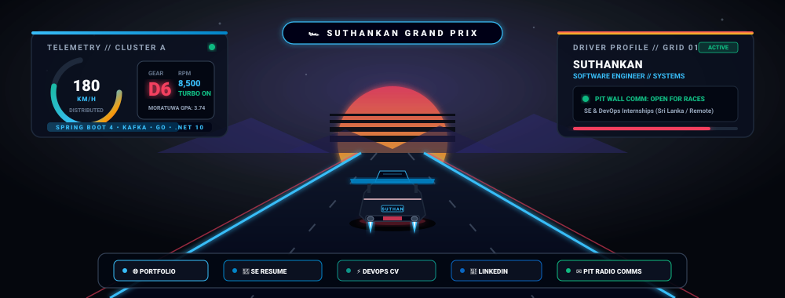
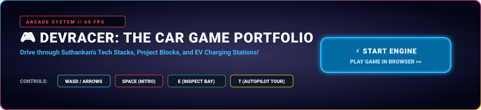
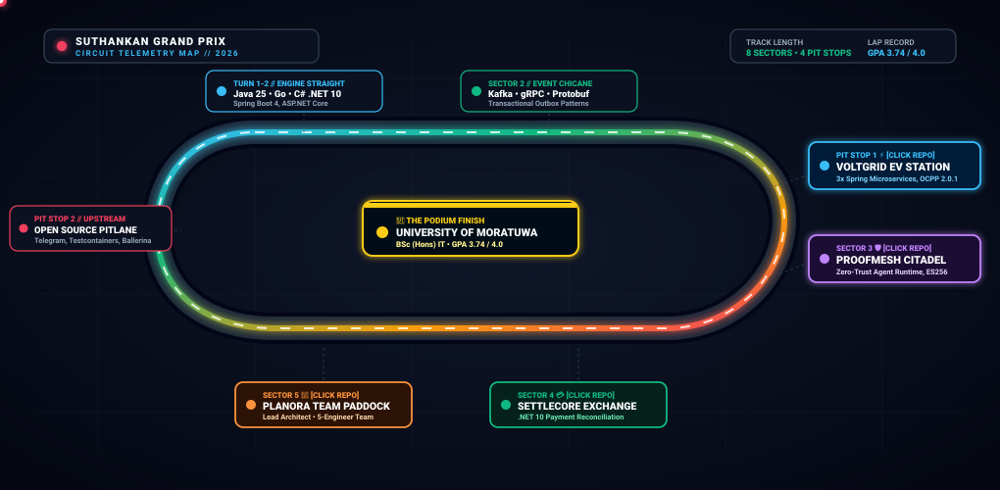

  <!-- HERO BANNER -->
  

    

  <!-- NAVIGATION & QUICK LINKS -->
  
  &nbsp;
  
  &nbsp;
  
  &nbsp;
  
  &nbsp;
  
  &nbsp;
  
  &nbsp;
  

    

  <!-- STATUS PILLS -->
  
  &nbsp;
  
  &nbsp;
  

 

---

## Profile

I am a full-stack developer at **axzell innovations (pvt) Ltd** in Colombo, Sri Lanka, and an Information Technology undergraduate at the **University of Moratuwa** (Cumulative GPA: **3.74 / 4.0**).

My primary focus at work is **Planora**, a production project-management SaaS where I own and build the authentication, task management, and document collaboration domains across web and mobile clients. 

Outside my day job, I build backend prototypes in Java and Go, explore event-driven messaging and zero-trust security, contribute upstream to open-source projects like Telegram Desktop and Testcontainers, and write technical articles on Medium.

<!-- TODO(Suthankan): Confirm or customize this personal learning note -->
*Currently reading Designing Data-Intensive Applications and experimenting with Go concurrency patterns.*

---

## Interactive Profile Game: DevRacer

Rather than keeping this profile strictly static, I built an interactive 2D top-down car game right into this repository using HTML5 Canvas and procedural Web Audio. You can drive through my production work, systems prototypes, and tech stack as physical buildings and road checkpoints.

  

 

* **Controls:** `WASD` or `Arrow Keys` to steer/accelerate · `Space` for nitro boost · `E` to inspect a project bay · `T` for automated recruiter tour · `H` for horn.
* 👉 **[Launch DevRacer live in your browser](https://suthankan1.github.io/Suthankan1/)**

---

## Circuit Telemetry Map

A circuit layout mapping my production systems, prototypes, and milestones:

  

 

---

## Production Work &amp; Flagship Projects

### Planora — Project Management SaaS (Production at axzell innovations)
**Full-Stack Developer &amp; Domain Owner** · *Next.js, React Native (Expo), TypeScript, Java, Spring Boot, PostgreSQL, WebSockets, AWS S3*
* Owned and built three core product domains: authentication workflows, task management state machines, and document collaboration.
* Engineered real-time project updates across web and mobile clients using WebSockets.
* Implemented secure file attachment processing with presigned S3 uploads and role-based access control.
* **[Live Application](https://planora-pma.netlify.app/)** · **[Repository](https://github.com/axzellinnovations/project_management_app)** · **[My Commit History](https://github.com/axzellinnovations/project_management_app/commits?author=Suthankan1)**

---

### VoltGrid — Distributed EV Charging Network Platform
**Backend Architect** · *Java 25, Spring Boot 4, Apache Kafka, gRPC, PostgreSQL, AWS ECS, Terraform*
* Prototyped a multi-service platform managing EV charge stations across 3 Spring Boot services using OCPP 2.0.1 WebSockets, gRPC, and Kafka.
* Built a Transactional Outbox pipeline on PostgreSQL to eliminate dual-write inconsistencies when publishing charging events to Kafka.
* Instrumented end-to-end distributed tracing across gRPC boundaries using OpenTelemetry.
* **[Repository](https://github.com/Suthankan1/voltgrid)** · **[Architecture Specification](https://github.com/Suthankan1/voltgrid/blob/main/README.md)**

---

### ProofMesh — Runtime Governance for Autonomous Agents
**Systems Engineer** · *Java 25, Spring Modulith, Go (Golang), PostgreSQL, Keycloak, ES256 / JWKS*
* Designed a zero-trust execution platform that decouples policy decisions from tool invocation for AI agents.
* Implemented cryptographic offline grant verification using ES256 and RFC 8785 canonical JSON hashing, preventing in-flight grant tampering.
* Enforced fail-closed claim verification with durable PostgreSQL claim tracking and automated credential stripping.
* **[Repository](https://github.com/Suthankan1/proofmesh)** · **[Security Model &amp; Invariants](https://github.com/Suthankan1/proofmesh#security-model--invariants)**

---

### SettleCore — Payment Operations &amp; Financial Reconciliation
**Backend Engineer** · *C#, .NET 10, ASP.NET Core, EF Core, PostgreSQL, GitHub Actions*
* Built a high-concurrency payment state machine focusing on provider reconciliation and idempotent capture processing.
* Enforced strict ledger invariants and provider-reference uniqueness backed by zero-data-loss EF Core migrations.
* Created a containerized integration test harness validating state transitions against simulated provider timeouts.
* **[Repository](https://github.com/Suthankan1/SettleCore)**

---

## Technical Stack

Organized by how I work with them:

* **Day-to-day (Production at axzell innovations &amp; Planora):**  
  Java, Spring Boot, TypeScript, Next.js, React, React Native (Expo), PostgreSQL, WebSockets, REST APIs, AWS S3.
* **Projects &amp; Systems Exploration:**  
  Go (Golang), Java 25, FastAPI, ChromaDB, Apache Kafka, gRPC, Protobuf, Redis, Docker, Terraform, ASP.NET Core (.NET 10).
* **Foundations &amp; Tooling:**  
  Linux, Git, GitHub Actions, OpenTelemetry, SQL, C, C++, Tailwind CSS.

---

## Open-Source Contributions

Upstream contributions to open-source developer tooling and runtimes:

| Project | Contribution | Status |
| :--- | :--- | :---: |
| **Telegram Desktop** | [Fix Mini App cookies on Linux](https://github.com/telegramdesktop/tdesktop/pull/31086) | `MERGED` |
| **lib_webview** | [Allow third-party cookies when requested](https://github.com/desktop-app/lib_webview/pull/146) | `MERGED` |
| **Telegram Desktop** | [Improve concurrent network proxy check routine](https://github.com/telegramdesktop/tdesktop/pull/31112) | `UNDER REVIEW` |
| **Testcontainers Java** | [Avoid changing global uncaught exception handler](https://github.com/testcontainers/testcontainers-java/pull/12076) | `UNDER REVIEW` |
| **Ballerina HTTP** | [Fix ambiguity diagnostics for HTTP service classes](https://github.com/ballerina-platform/module-ballerina-http/pull/2710) | `UNDER REVIEW` |
| **Ballerina YAML** | [Fix scalar tag regex matching compliance](https://github.com/ballerina-platform/module-ballerina-data.yaml/pull/43) | `UNDER REVIEW` |
| **WSO2 API Manager** | [Fix unnecessary Lambda resource request for API products](https://github.com/wso2/apim-apps/pull/1424) | `UNDER REVIEW` |

---

## Education &amp; Credentials

* **University of Moratuwa** — BSc (Hons) in Information Technology *(2024–2028)*  
  Semester GPAs: L1S1 **3.76**, L1S2 **3.72**, L2S1 **3.74** · **Cumulative GPA: 3.74 / 4.0**
* **AWS Educate** — Introduction to Cloud 101 *(2026)*
* **Cisco Networking Academy** — CCNA: Introduction to Networks *(2026)*
* **HackerRank** — REST API (Intermediate) *(2026)*
* **Packt** — Linux for Cloud &amp; DevOps Engineers *(2026)*
* **Postman** — Postman API Fundamentals Student Expert *(2025)*
* **IBM** — Developing Front-End Apps with React *(2025)*

---

## Contribution Activity

  <!-- 3D CONTRIBUTION CITYSCAPE GRAPH -->
  

    

  <!-- ANIMATED CONTRIBUTION GRID SNAKE -->
  

    

  <!-- GITHUB STREAK TELEMETRY -->
  

---

## Connect

I am actively seeking **Software Engineering, Full-Stack, and DevOps Internship** opportunities.

* **Email:** [suthankanbala2019@gmail.com](mailto:suthankanbala2019@gmail.com)
* **LinkedIn:** [linkedin.com/in/suthankan](https://www.linkedin.com/in/suthankan/)
* **Portfolio:** [suthankan.tech](https://www.suthankan.tech/)
* **Medium:** [medium.com/@suthankanbala2019](https://medium.com/@suthankanbala2019)
<!-- TODO(Suthankan): Confirm your Medium handle if different from @suthankanbala2019 -->
