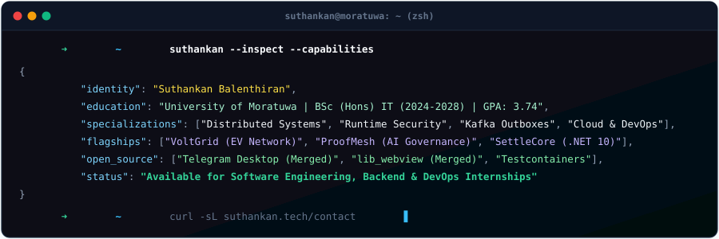
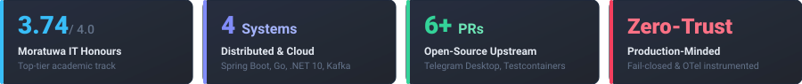

  <!-- HERO BANNER -->
  

    

  <!-- QUICK ACTION DOCK / BADGES -->
  
  
  
  
  

    

  <!-- STATUS STRIP -->
  
  
  

    

  <!-- DEVELOPER TERMINAL WIDGET -->
  

    

  <!-- EXECUTIVE METRICS BAR -->
  

 

---

## ⚡ Executive Overview

I am an Information Technology undergraduate at the **University of Moratuwa** building resilient backend, distributed, and cloud-native systems. My engineering methodology emphasizes **deterministic service boundaries**, **transactional outbox event streaming**, **fail-closed runtime security**, **PostgreSQL persistence guarantees**, and **end-to-end observability**.

* 🎓 **Academic Excellence:** BSc (Hons) in Information Technology (2024–2028) · Semester GPAs: L1S1 **3.76**, L1S2 **3.72**, L2S1 **3.74**.
* 🛠️ **Primary Stack:** Java (Spring Boot 4, Spring Modulith), Go, C# (.NET 10), PostgreSQL, Kafka, Docker, and AWS.
* 🛡️ **Core Philosophy:** "Design with invariants first, verify with integration tests via Testcontainers, and automate delivery with immutable infrastructure."
* 🚀 **Objective:** Seeking a **Software Engineering, Backend, Platform, or DevOps Internship** to deploy high-leverage production code and collaborate with high-caliber engineering teams.

---

## 🏗️ Flagship Engineering Systems

<table>
  <tr>
    <td width="50%" valign="top">
      <h3>⚡ VoltGrid</h3>
      
<strong>Distributed EV Charging Network Platform</strong>

      
A production-model distributed architecture simulating high-load EV charging infrastructure across 3 independently deployable Spring Boot microservices communicating via <strong>OCPP 2.0.1 WebSockets</strong>, <strong>gRPC</strong>, and <strong>Apache Kafka</strong>.

      <ul>
        <li>Implemented <strong>Transactional Outbox pattern</strong> to prevent dual-write anomalies between PostgreSQL and Kafka.</li>
        <li>Built idempotent consumers handling out-of-order and duplicate telemetry events.</li>
        <li>End-to-end distributed tracing via <strong>OpenTelemetry</strong> context propagation.</li>
        <li>Automated validation with <strong>Testcontainers</strong>; cloud-provisioned on <strong>AWS ECS</strong> via <strong>Terraform</strong>.</li>
      </ul>
      

        <code>Java 25</code> <code>Spring Boot 4</code> <code>OCPP 2.0.1</code> <code>gRPC</code> <code>Kafka</code> <code>GraphQL</code> <code>PostgreSQL</code> <code>AWS ECS</code> <code>Terraform</code>
      

      

        🔗 <a href="https://github.com/Suthankan1/voltgrid"><strong>Repository</strong></a> &nbsp;|&nbsp; 
        📐 <a href="https://github.com/Suthankan1/voltgrid/blob/main/README.md"><strong>Architecture &amp; Local Demo</strong></a>
      

    </td>
    <td width="50%" valign="top">
      <h3>🛡️ ProofMesh</h3>
      
<strong>Runtime Governance &amp; Security for Autonomous Agents</strong>

      
A zero-trust runtime policy enforcement engine decoupling policy reasoning from tool execution. Features a <strong>Spring Modulith</strong> control plane evaluating human approvals, paired with a high-throughput <strong>Go</strong> enforcement gateway.

      <ul>
        <li>Validates short-lived <strong>ES256 cryptographic grants</strong> offline via JWKS.</li>
        <li>Enforces exact request binding with <strong>RFC 8785 JSON canonicalization</strong>.</li>
        <li>Durable PostgreSQL claims preventing token replay attacks.</li>
        <li>Strips sensitive upstream credentials and defaults to strict <strong>fail-closed</strong> execution.</li>
      </ul>
      

        <code>Java 25</code> <code>Spring Modulith</code> <code>Go</code> <code>PostgreSQL</code> <code>Keycloak</code> <code>OIDC</code> <code>ES256 / JWKS</code> <code>RFC 8785</code> <code>Testcontainers</code>
      

      

        🔗 <a href="https://github.com/Suthankan1/proofmesh"><strong>Repository</strong></a> &nbsp;|&nbsp; 
        🔒 <a href="https://github.com/Suthankan1/proofmesh#security-model--invariants"><strong>Security Invariants</strong></a>
      

    </td>
  </tr>
  <tr>
    <td width="50%" valign="top">
      <h3>💳 SettleCore</h3>
      
<strong>Payment Operations &amp; Financial Reconciliation</strong>

      
A high-performance C# / .NET 10 backend dedicated to payment lifecycle management, provider-reference uniqueness, idempotent transitions, and financial reconciliation.

      <ul>
        <li>Domain invariants enforced at database &amp; application layers.</li>
        <li>Zero-data-loss database versioning with <strong>EF Core migrations</strong> on PostgreSQL.</li>
        <li>Full test suite with unit tests and containerized integration test harnesses.</li>
        <li>Strict CI/CD quality gates on GitHub Actions verifying build contracts.</li>
      </ul>
      

        <code>C#</code> <code>.NET 10</code> <code>ASP.NET Core</code> <code>EF Core</code> <code>PostgreSQL</code> <code>GitHub Actions</code> <code>Integration Testing</code>
      

      

        🔗 <a href="https://github.com/Suthankan1/SettleCore"><strong>Repository</strong></a>
      

    </td>
    <td width="50%" valign="top">
      <h3>👥 Planora</h3>
      
<strong>Agile Project Management Platform</strong>

      
<strong>Role: Team Lead (5-person engineering team)</strong> 
      Spearheaded architectural design, sprint planning, and code reviews for a multi-platform Scrum &amp; Kanban productivity application.

      <ul>
        <li>Led backlog prioritization and sprint execution adhering to Scrum principles.</li>
        <li>Contributed across Next.js frontend, Spring Boot backend, and React Native mobile client.</li>
        <li>Optimized PostgreSQL queries, transactional workflows, and role-based ACLs.</li>
        <li>Automated deployment pipeline with continuous integration.</li>
      </ul>
      

        <code>Next.js</code> <code>React Native</code> <code>Java</code> <code>Spring Boot</code> <code>PostgreSQL</code> <code>CI/CD</code> <code>Scrum</code>
      

      

        🌐 <a href="https://planora-pma.netlify.app/"><strong>Live App</strong></a> &nbsp;|&nbsp; 
        🔗 <a href="https://github.com/axzellinnovations/project_management_app"><strong>Repository</strong></a> &nbsp;|&nbsp; 
        💻 <a href="https://github.com/axzellinnovations/project_management_app/commits?author=Suthankan1"><strong>My Commits</strong></a>
      

    </td>
  </tr>
</table>

---

## 🌐 Open-Source Contributions & Upstream Patches

Contributing upstream to battle-tested production software and industry developer tooling:

| Ecosystem / Project | Upstream Contribution | Impact &amp; Technical Scope | Status |
| :--- | :--- | :--- | :---: |
| **Telegram Desktop** | [PR #31086: Fix Mini App cookies on Linux](https://github.com/telegramdesktop/tdesktop/pull/31086) | Resolved cookie persistence and session drop bug in Telegram Webview on Linux desktop client. | `MERGED` |
| **lib_webview** | [PR #146: Allow third-party cookies when requested](https://github.com/desktop-app/lib_webview/pull/146) | Enabled third-party cookie handling required for embedded web applications and authenticated views. | `MERGED` |
| **Telegram Desktop** | [PR #31112: Improve concurrent proxy check routine](https://github.com/telegramdesktop/tdesktop/pull/31112) | Optimized thread safety and connection handling across concurrent network proxy diagnostics. | `UNDER REVIEW` |
| **Testcontainers Java** | [PR #12076: Avoid overriding global uncaught exception handler](https://github.com/testcontainers/testcontainers-java/pull/12076) | Prevents test runner pollution by isolating thread exception handling during container lifecycles. | `UNDER REVIEW` |
| **Ballerina HTTP** | [PR #2710: Fix ambiguity diagnostics for service classes](https://github.com/ballerina-platform/module-ballerina-http/pull/2710) | Corrected compiler ambiguity detection for HTTP service class bindings and dispatch endpoints. | `UNDER REVIEW` |
| **Ballerina YAML** | [PR #43: Fix scalar tag regex pattern matching](https://github.com/ballerina-platform/module-ballerina-data.yaml/pull/43) | Patched regex evaluation for strict YAML spec scalar tag compliance. | `UNDER REVIEW` |
| **WSO2 API Manager** | [PR #1424: Eliminate unnecessary Lambda resource requests](https://github.com/wso2/apim-apps/pull/1424) | Removed redundant resource allocation calls in API product publishing workflow. | `UNDER REVIEW` |

---

## 🛠️ Comprehensive Technical Matrix

| Domain | Technologies &amp; Methodologies |
| :--- | :--- |
| **Core Languages** | `Java 25` · `Go (Golang)` · `C# (.NET 10)` · `TypeScript` · `JavaScript` · `Python` · `C / C++` · `SQL` |
| **Backend &amp; Distributed Systems** | `Spring Boot 4` · `Spring Modulith` · `ASP.NET Core` · `Apache Kafka` · `gRPC & Protobuf` · `GraphQL` · `RESTful APIs` · `WebSockets` · `OCPP 2.0.1` |
| **Reliability &amp; Architecture Patterns** | `Transactional Outbox` · `Idempotent Consumers` · `Domain-Driven Design (DDD)` · `Event-Driven Architecture` · `Microservices` · `State Machine Transitions` |
| **Security &amp; Identity** | `Keycloak` · `OAuth 2.0 / OIDC` · `ES256 / JWKS` · `RFC 8785 Canonical JSON` · `Spring Security` · `JWT/JWS` · `Fail-Closed Zero Trust` |
| **Databases &amp; Caching** | `PostgreSQL` · `Redis` · `Flyway Migrations` · `EF Core` · `Hibernate / JPA` · `pgvector` · `Connection Pooling (HikariCP)` |
| **Cloud, Platform &amp; DevOps** | `Docker & Docker Compose` · `AWS (ECS, RDS, VPC, IAM)` · `Terraform (IaC)` · `Linux (Ubuntu/Debian)` · `GitHub Actions CI/CD` · `Cloudflare` |
| **Observability &amp; Quality** | `OpenTelemetry (OTel)` · `Prometheus` · `Testcontainers` · `JUnit 5` · `MockMvc` · `xUnit` |
| **Frontend &amp; Cross-Platform** | `React.js` · `Next.js` · `React Native` · `Tailwind CSS` · `Flutter` · `PWA` |

---

## 📈 GitHub Telemetry & Activity

  <table border="0">
    <tr>
      <td align="center">
        
      </td>
      <td align="center">
        
      </td>
    </tr>
  </table>
  

---

## 🚀 Additional Engineering Projects

  
<strong>🔍 Click to expand additional multi-stack projects</strong>

   

  * 🎯 **[GrantAI](https://github.com/Suthankan1/grantai)** — Intelligent grant discovery and application workflow suite. Combines Next.js, Spring Boot, FastAPI, pgvector semantic search, Redis caching, and Docker.
  * 🧠 **[MindTrack](https://github.com/Suthankan1/mindtrack)** — Cross-platform wellbeing system with Flutter mobile frontend, Next.js dashboard, and Spring Boot backend delivering AI insights and crisis resource routing.
  * 🏥 **[OmniHealth](https://github.com/Suthankan1/OmniHealth)** — Complete hospital management ecosystem featuring clinical records, pharmacy inventory, billing workflows, and containerized deployment.
  * 🌌 **[Solar](https://github.com/Suthankan1/solar)** — Real-time 3D planetary physics and rendering engine built with C++ and modern OpenGL, featuring custom GLSL shaders, camera matrices, lighting, and bloom passes.
  * 🌐 **[Personal Portfolio](https://github.com/Suthankan1/suthankan-portfolio)** — Modern developer portfolio engineered with Next.js, TypeScript, MDX case studies, and automated edge deployment.

---

## 🎓 Education & Industry Credentials

### 🏛️ University of Moratuwa
**Bachelor of Science Honours in Information Technology** · *2024 – 2028*  
* Semester GPAs: **L1S1: 3.76** | **L1S2: 3.72** | **L2S1: 3.74**  
* Core Coursework: Data Structures &amp; Algorithms, Object-Oriented Software Development, Database Management Systems, Computer Networks, Operating Systems, Software Architecture.

### 📜 Verified Industry Certifications
* **AWS Educate** — Introduction to Cloud 101 *(2026)*
* **Cisco Networking Academy** — CCNA: Introduction to Networks *(2026)*
* **HackerRank** — REST API (Intermediate) Certificate *(2026)*
* **Packt** — Linux for Cloud &amp; DevOps Engineers *(2026)*
* **Postman** — Postman API Fundamentals Student Expert *(2025)*
* **IBM** — Developing Front-End Apps with React *(2025)*

---

## 🌟 Leadership & Community Impact

* 🤝 **Customer Relations Team Leader | AIESEC** — Led cross-functional teams in stakeholder communications, sprint delivery follow-ups, and international exchange operations.
* 💡 **Microsoft Learn Student Ambassador (Alpha) | Microsoft** — Organized peer learning workshops on cloud fundamentals, modern developer tooling, and clean code practices.

---

  ### 🤝 Let's Build Something Exceptional Together

  I am actively interviewing for **Software Engineering, Backend, Platform, and DevOps Internships**.  
  Whether you are architecting distributed services or looking for a fast-learning engineer with high ownership:

   

  
  &nbsp;&nbsp;
  
  &nbsp;&nbsp;
  

    

  Crafted with precision by <strong>Suthankan Balenthiran</strong> · University of Moratuwa

