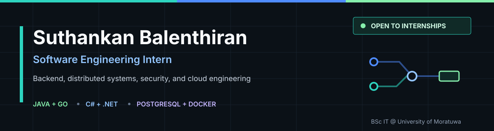
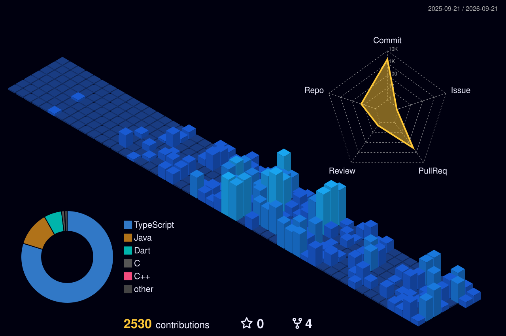

  

  
  
  
  

  
  

## Profile

I am an Information Technology undergraduate at the **University of Moratuwa** who enjoys turning complex workflows into reliable, useful software. My recent work spans full-stack platforms, Java backend systems, applied AI, cross-platform mobile development, and computer graphics.

I am currently seeking a **software engineering internship** where I can contribute to real products, learn from experienced engineers, and grow through thoughtful engineering and team delivery.

- BSc (Hons) in Information Technology, expected June 2028
- Strongest in Java, Spring Boot, TypeScript, Next.js, PostgreSQL, and REST API design
- Experienced in Agile teamwork, technical planning, code review, and project leadership
- Interested in backend engineering, full-stack development, applied AI, and networking

## Selected Work

### Planora - Agile Project Management System

**Team Lead | Five-person team**

Led the development of a full-stack project management platform for planning work through Kanban boards, sprint workflows, task ownership, and progress tracking. Coordinated delivery, reviewed code, and helped align the system with its functional and architectural requirements.

`TypeScript` `Next.js` `Java` `Spring Boot` `PostgreSQL` `Agile`

[View repository](https://github.com/axzellinnovations/project_management_app) | [View my contributions](https://github.com/axzellinnovations/project_management_app/commits?author=Suthankan1)

### OmniHealth - Hospital Management Ecosystem

Built a full-stack healthcare platform covering clinical, pharmacy, billing, diagnostics, emergency, HR, and administrative workflows. The system emphasizes role-based security, auditable actions, reliable data handling, and containerized delivery.

`Java` `Spring Boot` `Next.js` `TypeScript` `PostgreSQL` `Docker`

[View repository](https://github.com/Suthankan1/OmniHealth)

### GrantAI - Grant Discovery and Writing Platform

Created a multi-service platform for semantic grant matching, application tracking, AI-assisted cover letters, and interview practice. The architecture combines a modern web client, secured Java APIs, a Python AI service, vector search, caching, and containerized local development.

`Next.js` `Spring Boot` `FastAPI` `Gemini` `pgvector` `Redis` `Docker`

[View repository](https://github.com/Suthankan1/grantai)

### MindTrack - Cross-Platform Wellbeing Platform

Developed web and Flutter experiences backed by Spring Boot for mood journaling, AI-supported insights, coping sessions, therapist discovery, crisis resources, user preferences, and secure authentication.

`Flutter` `Next.js` `Spring Boot` `Gemini` `JWT` `PostgreSQL`

[View repository](https://github.com/Suthankan1/mindtrack)

## More Engineering Work

- **[Solar](https://github.com/Suthankan1/solar)** - A C++ and OpenGL solar-system simulation with custom shaders, textured celestial bodies, camera controls, lighting, bloom, asteroid belts, and scene components.
- **[Personal Portfolio](https://github.com/Suthankan1/suthankan-portfolio)** - A Next.js and TypeScript portfolio with MDX content, project case studies, search, analytics, dynamic social images, and a polished contact flow.

## Technical Toolbox

<table>
  <tr>
    <td><strong>Languages</strong></td>
    <td>Java, TypeScript, JavaScript, Python, C, C++, Dart</td>
  </tr>
  <tr>
    <td><strong>Frontend</strong></td>
    <td>React, Next.js, Flutter, HTML, CSS, Tailwind CSS</td>
  </tr>
  <tr>
    <td><strong>Backend</strong></td>
    <td>Spring Boot, FastAPI, REST APIs, Spring Security, JWT, JPA</td>
  </tr>
  <tr>
    <td><strong>Data and AI</strong></td>
    <td>PostgreSQL, pgvector, Redis, Gemini, LangChain, semantic search</td>
  </tr>
  <tr>
    <td><strong>Infrastructure</strong></td>
    <td>Docker, GitHub Actions, Vercel, Cloudflare, Git</td>
  </tr>
  <tr>
    <td><strong>Networking</strong></td>
    <td>Routing, network topology, Cisco Packet Tracer, CCNA preparation</td>
  </tr>
</table>

## Leadership and Community

- **Customer Relations Team Leader, AIESEC** - Led a team, coordinated cross-functional communication, and organized customer engagement operations.
- **Microsoft Learn Student Ambassador - Alpha** - Promoted technical learning and shared Microsoft development resources within the university community.
- **Project Leadership** - Plan work using Agile practices, coordinate responsibilities, review contributions, and keep delivery aligned with requirements.

## Education

**University of Moratuwa** 
Bachelor of Science Honours in Information Technology 
March 2024 - Expected June 2028

## Contribution Activity

  

---

  I am open to internship opportunities in software engineering, full-stack development, backend engineering, and applied AI.
   
  <a href="mailto:suthankanbala2019@gmail.com"><strong>Start a conversation</strong></a>

