<!DOCTYPE html>
<html lang="en">
<head>
  <meta charset="UTF-8">
  <meta name="viewport" content="width=device-width, initial-scale=1.0">
  <title>Suthankan Balenthiran - Living Portfolio Gallery</title>
</head>
<body>

<!-- Hidden Easter Egg Quote -->
<!-- "The best way to predict the future is to create it." - Peter Drucker -->

<div align="center">

<!-- Hero Section with Animated SVG Character -->
<svg width="100%" height="400" viewBox="0 0 800 400" xmlns="http://www.w3.org/2000/svg">
  <!-- Gradient Definitions -->
  <defs>
    <linearGradient id="bgGradient" x1="0%" y1="0%" x2="100%" y2="100%">
      <stop offset="0%" style="stop-color:#667eea;stop-opacity:1">
        <animate attributeName="stop-color" values="#667eea;#764ba2;#667eea" dur="10s" repeatCount="indefinite"/>
      </stop>
      <stop offset="100%" style="stop-color:#764ba2;stop-opacity:1">
        <animate attributeName="stop-color" values="#764ba2;#667eea;#764ba2" dur="10s" repeatCount="indefinite"/>
      </stop>
    </linearGradient>
    
    <linearGradient id="cardGradient" x1="0%" y1="0%" x2="100%" y2="100%">
      <stop offset="0%" style="stop-color:#f093fb;stop-opacity:0.8"/>
      <stop offset="100%" style="stop-color:#f5576c;stop-opacity:0.8"/>
    </linearGradient>
    
    <filter id="glow">
      <feGaussianBlur stdDeviation="4" result="coloredBlur"/>
      <feMerge>
        <feMergeNode in="coloredBlur"/>
        <feMergeNode in="SourceGraphic"/>
      </feMerge>
    </filter>
  </defs>
  
  <!-- Background with animated gradient -->
  <rect width="800" height="400" fill="url(#bgGradient)" opacity="0.3"/>
  
  <!-- Floating bubbles animation -->
  <circle cx="100" cy="300" r="20" fill="#ffffff" opacity="0.2">
    <animate attributeName="cy" values="300;100;300" dur="15s" repeatCount="indefinite"/>
  </circle>
  <circle cx="700" cy="250" r="30" fill="#ffffff" opacity="0.15">
    <animate attributeName="cy" values="250;50;250" dur="20s" repeatCount="indefinite"/>
  </circle>
  <circle cx="500" cy="350" r="25" fill="#ffffff" opacity="0.2">
    <animate attributeName="cy" values="350;150;350" dur="18s" repeatCount="indefinite"/>
  </circle>
  
  <!-- Animated Character/Avatar -->
  <g transform="translate(300, 150)">
    <!-- Desk -->
    <rect x="20" y="120" width="160" height="10" rx="5" fill="#764ba2" opacity="0.7"/>
    
    <!-- Computer Screen -->
    <rect x="60" y="60" width="80" height="60" rx="5" fill="#667eea" opacity="0.8"/>
    <rect x="65" y="65" width="70" height="50" rx="3" fill="#0a0e27"/>
    
    <!-- Code on screen with animation -->
    <text x="70" y="80" font-family="monospace" font-size="6" fill="#00ff00" opacity="0.8">
      <tspan x="70" dy="0">const dev = () => {</tspan>
      <tspan x="70" dy="8">  return 'code';</tspan>
      <tspan x="70" dy="8">};</tspan>
      <animate attributeName="opacity" values="0.8;1;0.8" dur="2s" repeatCount="indefinite"/>
    </text>
    
    <!-- Person (simplified) -->
    <!-- Head -->
    <circle cx="100" cy="30" r="18" fill="#ffdbac">
      <animate attributeName="cy" values="30;28;30" dur="3s" repeatCount="indefinite"/>
    </circle>
    
    <!-- Eyes (blinking) -->
    <circle cx="95" cy="28" r="2" fill="#000000">
      <animate attributeName="r" values="2;2;0;2;2" dur="5s" repeatCount="indefinite"/>
    </circle>
    <circle cx="105" cy="28" r="2" fill="#000000">
      <animate attributeName="r" values="2;2;0;2;2" dur="5s" repeatCount="indefinite"/>
    </circle>
    
    <!-- Body -->
    <ellipse cx="100" cy="70" rx="25" ry="35" fill="#667eea">
      <animate attributeName="cy" values="70;68;70" dur="3s" repeatCount="indefinite"/>
    </ellipse>
    
    <!-- Arms typing -->
    <path d="M 75 60 Q 50 80, 60 100" stroke="#ffdbac" stroke-width="6" fill="none" stroke-linecap="round">
      <animate attributeName="d" values="M 75 60 Q 50 80, 60 100;M 75 60 Q 50 85, 58 105;M 75 60 Q 50 80, 60 100" dur="1s" repeatCount="indefinite"/>
    </path>
    <path d="M 125 60 Q 150 80, 140 100" stroke="#ffdbac" stroke-width="6" fill="none" stroke-linecap="round">
      <animate attributeName="d" values="M 125 60 Q 150 80, 140 100;M 125 60 Q 150 85, 142 105;M 125 60 Q 150 80, 140 100" dur="1s" repeatCount="indefinite"/>
    </path>
  </g>
  
  <!-- Floating elements around character -->
  <g opacity="0.6">
    <text x="150" y="100" font-size="30" fill="#ffd700" filter="url(#glow)">
      ⚡
      <animateTransform attributeName="transform" type="translate" values="0,0;0,-10;0,0" dur="2s" repeatCount="indefinite"/>
    </text>
    <text x="600" y="150" font-size="30" fill="#ffd700" filter="url(#glow)">
      💎
      <animateTransform attributeName="transform" type="translate" values="0,0;0,-10;0,0" dur="2.5s" repeatCount="indefinite"/>
    </text>
    <text x="200" y="300" font-size="30" fill="#ffd700" filter="url(#glow)">
      🚀
      <animateTransform attributeName="transform" type="translate" values="0,0;0,-10;0,0" dur="3s" repeatCount="indefinite"/>
    </text>
  </g>
  
  <!-- Welcome Text -->
  <text x="400" y="340" font-size="40" font-weight="bold" fill="#ffffff" text-anchor="middle" filter="url(#glow)">
    Suthankan Balenthiran
  </text>
  <text x="400" y="370" font-size="18" fill="#ffffff" text-anchor="middle" opacity="0.9">
    IT Undergraduate • Full Stack Developer • Creative Coder
  </text>
</svg>

</div>

---

<div align="center">

## ✨ Welcome to My Living Portfolio Gallery ✨

[](https://linkedin.com/in/suthankan-balenthiran-437633271)
[](https://twitter.com/b_suthankan)
[](https://instagram.com/suthankan_balenthiran)
[](mailto:Suthankanbala2019@gmail.com)

</div>

---

<!-- About Me Glassmorphic Card -->
<div align="center">

### 🌟 About Me

<table>
<tr>
<td width="60%">

```yaml
name: Suthankan Balenthiran
location: Sri Lanka 🇱🇰
education: IT Undergraduate @ University of Moratuwa
passion: Building beautiful & functional applications
specialty: Full Stack Development + UI/UX Design
current_focus: Advanced Java, Spring Boot, CCNA
fun_fact: I code best while listening to Tamil melodies 🎵
philosophy: "Code is poetry, debug is meditation"
```

**💡 What I'm Up To:**
- 🔭 Working on full-stack web applications
- 🌱 Learning advanced Spring Boot & microservices
- 🎨 Designing intuitive UIs in Figma
- 🤝 Open to collaborating on innovative projects
- 💬 Ask me about Java, Python, React, or Networking

</td>
<td width="40%">


</td>
</tr>
</table>

</div>

---

<!-- 3D Card Deck - Skills Section -->
<div align="center">

### 🎴 Skill Card Deck

<details open>
<summary><b>💻 Programming Languages</b></summary>

<br/>

| Skill | Proficiency | Experience |
|-------|------------|-----------|
|  | ⭐⭐⭐⭐⭐ | 3+ years |
|  | ⭐⭐⭐⭐ | 2+ years |
|  | ⭐⭐⭐⭐ | 2+ years |
|  | ⭐⭐⭐ | 2+ years |

</details>

<details open>
<summary><b>🎨 Frontend & Design</b></summary>

<br/>

| Technology | Proficiency | Projects |
|-----------|------------|----------|
|  | ⭐⭐⭐⭐ | 10+ |
|  | ⭐⭐⭐⭐ | 5+ |
|  | ⭐⭐⭐⭐⭐ | Extensive |
|  | ⭐⭐⭐⭐⭐ | Extensive |
|  | ⭐⭐⭐⭐ | UI/UX |

</details>

<details open>
<summary><b>⚙️ Backend & Databases</b></summary>

<br/>

| Technology | Proficiency | Use Case |
|-----------|------------|----------|
|  | ⭐⭐⭐⭐ | Enterprise Apps |
|  | ⭐⭐⭐⭐ | REST APIs |
|  | ⭐⭐⭐⭐ | Relational DB |
|  | ⭐⭐⭐ | Advanced DB |

</details>

<details open>
<summary><b>🛠️ Tools & Technologies</b></summary>

<br/>

| Tool | Proficiency | Purpose |
|------|------------|---------|
|  | ⭐⭐⭐⭐⭐ | Version Control |
|  | ⭐⭐⭐⭐⭐ | Collaboration |
|  | ⭐⭐⭐⭐⭐ | Primary IDE |
|  | ⭐⭐⭐⭐ | Java Development |

</details>

</div>

---

<!-- Journey Timeline -->
<div align="center">

### 🗺️ My Coding Journey

```mermaid
graph LR
    A[🌱 Started<br/>2020] -->|First Line| B[📚 Learning<br/>2021]
    B -->|Built Projects| C[🚀 Growing<br/>2022]
    C -->|Advanced Topics| D[💼 Developing<br/>2023]
    D -->|Professional Work| E[⭐ Thriving<br/>2024]
    E -->|Innovation| F[🎯 You Are Here<br/>2025+]
    
    style A fill:#667eea,stroke:#764ba2,stroke-width:3px,color:#fff
    style B fill:#764ba2,stroke:#667eea,stroke-width:3px,color:#fff
    style C fill:#f093fb,stroke:#f5576c,stroke-width:3px,color:#fff
    style D fill:#f5576c,stroke:#f093fb,stroke-width:3px,color:#fff
    style E fill:#ffd700,stroke:#ff6b9d,stroke-width:3px,color:#000
    style F fill:#00ff00,stroke:#ffd700,stroke-width:4px,color:#000
```



**Key Milestones:**
- 🎓 **2020**: Started IT Degree at University of Moratuwa
- 💻 **2021**: First Java project & fell in love with coding
- 🌐 **2022**: Built first full-stack web application
- ⚡ **2023**: Mastered React & Spring Boot frameworks
- �� **2024**: Started UI/UX design journey with Figma
- 🚀 **2025**: Contributing to open source & building amazing projects

</div>

---

<!-- Gamification Section -->
<div align="center">

### 🎮 Developer Stats & Achievements

```
╔═══════════════════════════════════════════════════════════╗
║                    SUTHANKAN BALENTHIRAN                  ║
║              🌟 Level 42 Full Stack Developer 🌟          ║
╠═══════════════════════════════════════════════════════════╣
║                                                           ║
║  ⚡ XP Progress:  ▓▓▓▓▓▓▓▓▓▓▓▓▓▓▓▓░░░░  850/1000 XP      ║
║                                                           ║
║  🏆 Achievements Unlocked: 15                             ║
║  🔥 Current Streak: 47 days                               ║
║  💻 Projects Completed: 23                                ║
║  ⭐ Total GitHub Stars: 150+                              ║
║  🤝 Pull Requests Merged: 45                              ║
║                                                           ║
║  🎖️  Active Badges:                                       ║
║  ⚔️  Code Warrior    🎯 Bug Hunter    💎 Clean Coder     ║
║  🌟 Open Source Hero 🚀 Fast Learner  🎨 UI Craftsman    ║
║                                                           ║
╚═══════════════════════════════════════════════════════════╝
```


</div>

---

<!-- GitHub Stats Dashboard -->
<div align="center">

### 📊 GitHub Statistics Infographic

<!-- Stats Cards -->


<!-- Contribution Streak -->


<!-- Activity Graph -->


<!-- Contribution Snake -->
<picture>
  <source media="(prefers-color-scheme: dark)" srcset="https://github.com/suthankan1/suthankan1/blob/output/github-contribution-grid-snake-dark.svg" />
  <source media="(prefers-color-scheme: light)" srcset="https://github.com/suthankan1/suthankan1/blob/output/github-contribution-grid-snake.svg" />
  
</picture>

</div>

---

<!-- Projects Gallery -->
<div align="center">

### 🚀 Featured Projects Gallery

<table>
<tr>
<td width="50%">

#### 💼 Enterprise Management System
**Tech Stack:** Java, Spring Boot, PostgreSQL, React

A comprehensive enterprise resource planning system with role-based access control, real-time data synchronization, and advanced reporting capabilities.

**Features:**
- 🔐 Secure authentication & authorization
- 📊 Dynamic dashboard with analytics
- 📱 Responsive mobile-friendly design
- ⚡ Real-time updates with WebSockets

[](https://github.com)
[](https://github.com)

</td>
<td width="50%">

#### 🌐 Social Media Dashboard
**Tech Stack:** React, Node.js, Express, MongoDB

An elegant social media analytics platform that aggregates data from multiple platforms and provides insightful visualizations.

**Features:**
- 📈 Real-time analytics dashboard
- 🎨 Beautiful data visualizations
- 🔄 Auto-sync with social platforms
- 📱 Progressive Web App (PWA)

[](https://github.com)
[](https://github.com)

</td>
</tr>

<tr>
<td width="50%">

#### 🎨 Design Portfolio Website
**Tech Stack:** Next.js, Tailwind CSS, Framer Motion

A stunning portfolio website showcasing UI/UX design work with smooth animations and interactive elements.

**Features:**
- ✨ Glassmorphism design
- 🎭 Smooth page transitions
- 🖼️ Dynamic project gallery
- 🌓 Dark/Light mode toggle

[](https://github.com)
[](https://github.com)

</td>
<td width="50%">

#### 🔒 Network Security Tool
**Tech Stack:** Python, Scapy, Tkinter

A network monitoring and security analysis tool for detecting anomalies and potential security threats.

**Features:**
- 🔍 Real-time packet inspection
- ��️ Threat detection algorithms
- 📊 Network traffic visualization
- 🚨 Automated alert system

[](https://github.com)
[](https://github.com)

</td>
</tr>
</table>

<details>
<summary><b>🔥 See More Projects (Click to Expand)</b></summary>

<br/>

| Project | Description | Tech Stack | Links |
|---------|-------------|-----------|-------|
| 🎵 Music Streaming App | Spotify-like music player with playlist management | React, Firebase, API Integration | [GitHub](https://github.com) \| [Demo](https://github.com) |
| 📝 Task Management Tool | Kanban-style project management application | Vue.js, Express, MongoDB | [GitHub](https://github.com) \| [Demo](https://github.com) |
| 🤖 Chatbot Assistant | AI-powered customer service chatbot | Python, NLP, Flask | [GitHub](https://github.com) \| [Demo](https://github.com) |
| 🏪 E-commerce Platform | Full-featured online shopping platform | Java, Spring Boot, MySQL | [GitHub](https://github.com) \| [Demo](https://github.com) |
| 📱 Mobile Weather App | Beautiful weather forecast application | React Native, Weather API | [GitHub](https://github.com) \| [Demo](https://github.com) |

</details>

</div>

---

<!-- Contact Section with Animation -->
<div align="center">

### 💌 Let's Connect & Collaborate!


**I'm always excited to:**
- 🤝 Collaborate on innovative projects
- 💡 Discuss new technologies and ideas
- 🎨 Work on creative design challenges
- 🌟 Contribute to open source
- 📚 Share knowledge and learn together

<table>
<tr>
<td align="center" width="25%">
<a href="https://linkedin.com/in/suthankan-balenthiran-437633271">

<br/><b>LinkedIn</b>
</a>
</td>
<td align="center" width="25%">
<a href="https://twitter.com/b_suthankan">

<br/><b>Twitter</b>
</a>
</td>
<td align="center" width="25%">
<a href="https://instagram.com/suthankan_balenthiran">

<br/><b>Instagram</b>
</a>
</td>
<td align="center" width="25%">
<a href="mailto:Suthankanbala2019@gmail.com">

<br/><b>Email</b>
</a>
</td>
</tr>
</table>

<br/>

**📧 Email:** Suthankanbala2019@gmail.com  
**📍 Location:** Sri Lanka 🇱🇰  
**⏰ Timezone:** GMT+5:30  
**💼 Status:** Open to opportunities

<br/>

[](https://www.buymeacoffee.com/suthankan1)

</div>

---

<!-- Footer with Wave and Quote -->
<div align="center">


### 💭 Thought of the Day

> *"First, solve the problem. Then, write the code."* – John Johnson

---


**⭐ Star my repositories if you find them interesting!**

<!-- Easter Egg: Hover on this emoji for a secret! �� -->
<!-- Secret Message: Congratulations! You found the hidden message. Keep coding and stay awesome! 🚀 -->

<sub>Last updated: February 2025 | Made with ❤️ and ☕ by Suthankan Balenthiran</sub>

</div>

</body>
</html>
